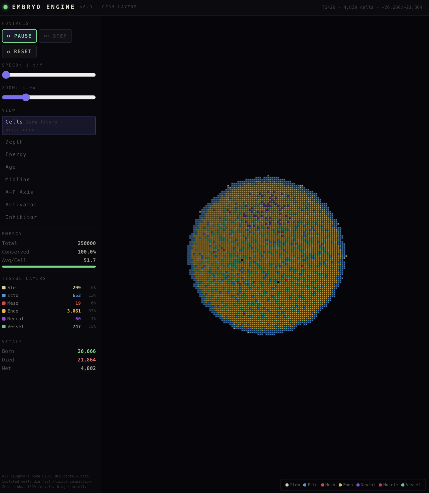

# Embryo Engine

A cellular automata simulation demonstrating how **conservation laws + local symmetry breaking → emergent biological structure**. Starting from ~30 identical stem cells, the system self-organizes into a layered organism with seven distinct tissue types — no central controller, no hardcoded body plan.

Built as a single-file React component with HTML5 Canvas rendering.

**[Try it live](https://yamcomnet.github.io/embryo-engine/)**



## The Idea

If the universe is computational, what would the "game board" look like?

Real physics has a deep connection between symmetry and conservation (Noether's theorem): time symmetry gives energy conservation, spatial symmetry gives momentum conservation. Meanwhile, biology runs on *breaking* those symmetries locally — an embryo starts symmetric and becomes asymmetric through differentiation.

This simulation asks: **what's the minimal set of rules that produces embryo-like behavior from physics-like constraints?**

The answer turns out to be three rules and one law:

- **Law:** Energy is conserved (zero sinks, zero sources)
- **Rule 1:** Divide when energy-rich (cell splits 50/50)
- **Rule 2:** Die when old (senescence, energy recycled 100% to neighbors)
- **Rule 3:** Become what your depth demands (BFS distance to surface determines cell fate)

## How It Works

### Energy Architecture

All energy exists inside living cells. There is no environmental substrate, no background field. The total energy budget (250,000 units) is fixed at initialization and distributed among seed cells.

- **Division** halves the parent's energy — this is the only "cost" of growth
- **Death** recycles 100% of a cell's energy to its living neighbors
- **Sharing** equalizes energy between adjacent cells (5% gradient flow per tick)
- **No metabolism drain** — the system achieves perfect conservation

The organism self-regulates: it grows until average energy per cell drops below the division threshold (30), then stabilizes. Old cells die, enriching neighbors, who divide, continuing the cycle indefinitely.

### Tissue Layering via BFS Depth

Every daughter cell is born as **stem**. After 12 ticks, it differentiates based on its BFS depth — the shortest path distance to the nearest empty cell:

| Depth | Tissue | Role |
|-------|--------|------|
| 1 (surface) | **Ectoderm** | Outer protective layer |
| 1 + midline + AP signal | **Neural** | Nervous system (bilateral midline) |
| 2 (sub-surface) | **Mesoderm** | Middle layer, later specializes |
| 3–5 (mid-depth) | **Endoderm** | Inner core, gut-like tissue |
| 6+ (deep) | **Stem** | Protected niche, replenishes all types |

This mirrors real gastrulation: ectoderm outside, mesoderm in the middle, endoderm inside, with a stem reservoir in the deep core.

### Morphogen Signals

Four diffusible morphogen channels drive patterning:

1. **Activator** (Turing short-range) — autocatalytic, creates spots/stripes
2. **Inhibitor** (Turing long-range) — diffuses 2.5× faster, suppresses activator at distance
3. **Midline** — Gaussian signal peaked at the organism's x-centroid, creates bilateral symmetry
4. **Anterior-Posterior** — gradient from centroid upward, drives head-tail axis

Neural tissue forms where midline and AP signals intersect — analogous to the neural plate in real vertebrate development. Mesoderm further specializes into **muscle** (high activator + inhibitor) or **vessel** (low activator + high inhibitor) via Turing pattern thresholds.

### Tissue Compaction

Cells with zero living neighbors die instantly. Cells with only one neighbor have an 8% death chance per tick. This prevents satellite debris while allowing free convex growth — the organism expands naturally but self-prunes isolated cells.

## What Emerges

Starting from identical stem cells in a circle:

1. **Cleavage** (T0–30): Rapid division, expanding mass
2. **Blastulation** (T30–100): Surface cells become ectoderm, interior differentiates
3. **Gastrulation** (T100–200): Concentric germ layers form (ecto → meso → endo → stem core)
4. **Organogenesis** (T200+): Neural plate appears at dorsal midline, mesoderm specializes into muscle and vessel, tissue composition stabilizes with active turnover

Typical steady-state composition:

| Type | Proportion | Notes |
|------|-----------|-------|
| Ectoderm | ~35–45% | Grows as surface area increases |
| Endoderm | ~15–30% | Core tissue, shrinks proportionally as shape complexifies |
| Vessel | ~18–30% | Most mesoderm specializes here |
| Neural | ~5–11% | Longest-lived cells, accumulates over time |
| Stem | ~1–6% | Deep niche, maintains regenerative capacity |
| Mesoderm | ~0–1% | Transient — rapidly specializes into muscle/vessel |
| Muscle | ~0–2% | Requires specific Turing pattern conditions |

The organism sustains itself through continuous turnover: 400,000+ births and deaths while maintaining 95–100% energy conservation.

## Views

| View | Shows |
|------|-------|
| **Cells** | Tissue types with energy-brightness and cell borders at zoom ≥3x |
| **Depth** | BFS distance to surface — the field that drives all differentiation |
| **Energy** | Per-cell reserves (bright = energy-rich) |
| **Age** | Green (young) → red (old), shows generational turnover waves |
| **Midline** | Bilateral symmetry signal (Gaussian at x-centroid) |
| **A-P Axis** | Anterior-posterior gradient |
| **Activator** | Turing short-range morphogen |
| **Inhibitor** | Turing long-range morphogen |

## Controls

- **Run / Pause / Step** — simulation control
- **Speed** — 1–6 ticks per frame
- **Zoom** — 1–14x (scroll wheel also works)
- **Pan** — click and drag
- **View modes** — switch between visualization layers

## Technical Details

- **Grid:** 200×200, toroidal (wrapped edges)
- **Data:** Typed arrays — `Uint8Array` (cells), `Float32Array` (energy, morphogens), `Uint16Array` (age)
- **Rendering:** Direct pixel manipulation via `ImageData` for performance
- **Update order:** Fisher-Yates shuffled each tick to prevent directional bias
- **BFS depth:** Computed fresh each tick via breadth-first search from all surface cells inward

### Parameters

```
TOTAL_E      = 250,000   Total energy budget
DIV_THRESH   = 30        Energy needed to divide
DIV_COOLDOWN = 14        Min ticks between divisions
SENESCENCE   = 500       Base max age (type-dependent multiplier)
SHARE_RATE   = 0.05      Pairwise energy equalization rate
M_DIFF       = 0.13      Morphogen diffusion rate
M_DECAY      = 0.96      Morphogen decay per tick
DIFF_AGE     = 12        Min age before differentiation
```

## Development Journey

This simulation went through 9 major iterations to get the energy model right:

| Version | Problem | Solution |
|---------|---------|----------|
| v0.1 | Growth stalls at ~74 cells | Energy siloed, no redistribution |
| v0.2 | Stalls at ~3K cells | Added energy diffusion, still insufficient |
| v0.3 | Total extinction | Added death/recycling, but substrate too dilute |
| v0.4 | Gaussian substrate helps | Energy still leaks through metabolism + death waste |
| v0.5 | 75% energy loss over time | Metabolism → substrate (closed loop), but substrate diffuses into void |
| v0.6 | All energy drains to 0 | Removed substrate, energy only in cells — but metabolism still a sink |
| v0.7 | **First sustained life** | Zero metabolism, division = only cost, 99%+ conservation |
| v0.8 | Only ectoderm + vessel | Daughters copied parent type — fixed: all daughters born STEM |
| v0.9 | All 7 types, 100% conservation | BFS depth for layering, isolation pressure for compaction |

The key insight at each stage: **every energy flow must have a destination**. Metabolism that vanishes, death waste that disappears, substrate that diffuses into empty space — all of these are invisible leaks that eventually drain the system. The final architecture has literally zero sinks.

## Conceptual Framework

This project grew from a thought experiment about the simulation hypothesis:

> If the universe is a computation, organisms inside would experience consistent conservation laws, reproducible chemistry, and evolutionary history. Grid symmetries would appear as fundamental physics to internal observers, not design choices.

The simulation demonstrates this concretely: starting from an energy conservation law (the "physics") and local cell rules (the "chemistry"), complex biological structure emerges without being programmed. The organism doesn't know about germ layers or tissue types — it just follows three rules, and gastrulation happens.

This relationship between **global symmetry → conservation law → local breaking → emergent complexity** is, arguably, the deepest pattern in nature. The Embryo Engine is a minimal demonstration of that pattern.

## Running

This is a single React (JSX) component. It runs in any environment that supports React with hooks:

- **Claude.ai** — upload or paste as an Artifact
- **Vite + React** — drop into a project with `npm create vite@latest`
- **CodeSandbox / StackBlitz** — paste into `App.jsx`

No dependencies beyond React itself.

## License

MIT
