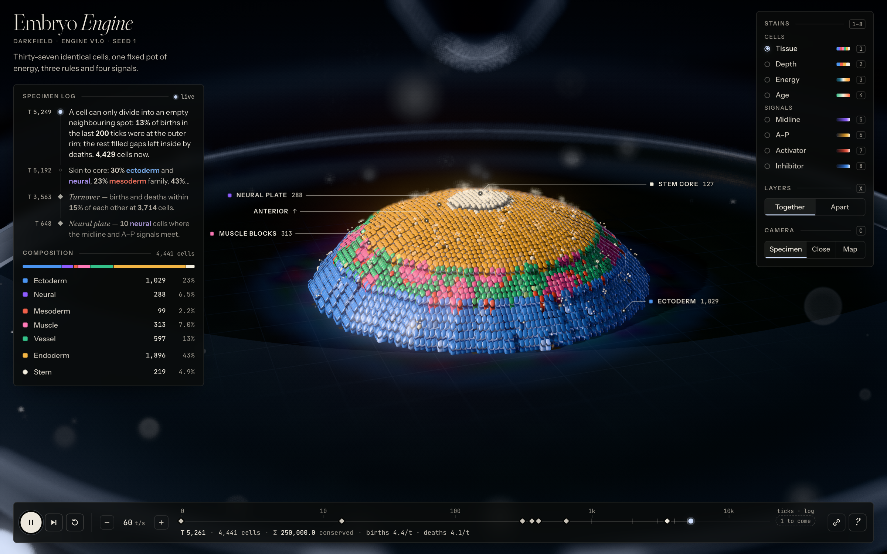

# Embryo Engine

*What's the minimal set of rules that produces embryo-like behavior from physics-like constraints?*

A cellular automaton that grows an embryo from **37 identical stem cells** and a fixed pot of energy that is never created or destroyed. One conservation law, three rules (divide, die, become what your depth demands) and four signal fields turn the founders into a layered organism with seven tissue types: concentric germ layers, an anterior neural plate, and a mesoderm ring that a Turing activator–inhibitor pattern breaks into muscle blocks separated by vessel.

Version 1.0 "Darkfield" shows it as a living specimen under a darkfield microscope, in 3D: only light scattered by living tissue reaches you, so cells glow against black. Every colour, glow, label and number on screen is read from the running simulation.

**[Try it live](https://yamcomnet.github.io/embryo-engine/)**



## The Idea

If the universe is computational, what would the "game board" look like?

Real physics has a deep connection between symmetry and conservation (Noether's theorem): time symmetry gives energy conservation, spatial symmetry gives momentum conservation. Meanwhile, biology runs on *breaking* those symmetries locally — an embryo starts symmetric and becomes asymmetric through differentiation.

This simulation asks: **what's the minimal set of rules that produces embryo-like behavior from physics-like constraints?**

The answer, in v1.0, is one law, three rules and four signals:

- **Law: energy is conserved.** 250,000 units, shared equally by the founders. Nothing creates or destroys energy: cells pass it to their neighbours, split it when they divide, and hand all of it on when they die.
- **Rule 1: divide.** A cell holding more than 30 energy (stem) or 42 (any other type), and older than 14 ticks, splits in two if a neighbouring place is empty. The daughter is always a stem cell, and each keeps half.
- **Rule 2: die.** Of old age, when a cell has no living neighbour, or (8% a tick) when it is an exposed tip with one neighbour. Its energy goes to the nearest living cells.
- **Rule 3: become what your depth demands.** A cell's depth is counted in steps from the embryo's outer surface. Four bands, scaled to the depth of the deepest cell, assign the fate: ectoderm outside, then mesoderm, endoderm, and a stem core.
- **Signals.** Four fields diffuse and fade across the tissue. An activator that amplifies itself, and the inhibitor it makes, form spots and stripes on their own. A midline signal and an anterior–posterior (A–P, head–tail) signal are laid down around the embryo's centre and gate the neural plate.

### What is local, and what is not

The honest version of "three simple rules":

- **Rules 1 and 2 are local:** a cell and its four neighbours.
- **Rule 3 is not.** Depth is measured from the outside of the whole embryo, the band edges scale with the whole embryo's depth, and the muscle/vessel choice compares a cell's activator with the mean of every live cell at the same depth.
- **Midline and A–P are positional information,** laid down around the embryo's centroid, with "anterior" fixed to one side of the dish. The neural plate appears where these two imposed gradients overlap, so its anterior position is expected, not discovered.
- **The order of the layers is what Rule 3 assigns.** Cells never move, so this is layering by position, not gastrulation by cell migration.
- **What does organise itself:** the activator–inhibitor labyrinth (about 11–14 cells between spots) and the muscle blocks it carves, the embryo's size, its steady turnover of births and deaths, and a stem core that renews itself.
- **Energy transport is local,** except for a fallback: energy from a death with no living cell within two steps is spread over every living cell. In seed 1 it never fired before T 5,000.

## How It Works

### Energy

All energy lives inside cells: there is no substrate and no background field.

- **Sharing:** every pair of neighbours evens out 5% of their difference each tick.
- **Division** halves the parent's energy. It is the only "cost" of growth.
- **Death** hands everything to the living: to the dead cell's live neighbours, else to live cells two steps away, else to a pool shared by every live cell at the end of the tick.
- **Measured:** the worst relative error in the total over 5 runs of 20,000 ticks is 2.3 × 10⁻¹⁶, one or two rounding units of a compensated sum. Energy lost: 0.

The embryo grows until energy per cell approaches the division thresholds, then keeps turning over: at T 20,000 about 6,900 cells hold 250,000 / 6,895 ≈ 36.3 each, between the stem (30) and differentiated (42) thresholds.

### Depth and fate (Rule 3)

- **Depth** counts steps from the exterior: the empty region outside the embryo. Holes left inside by deaths are not surfaces.
- **Bands** are fractions of the deepest cell's depth: outer 15% ectoderm (neural where the midline and A–P signals both pass 0.18), to 30% mesoderm, to 85% endoderm, deeper stem.
- **Continuously:** every stem, ecto, meso or endo cell older than 12 ticks re-reads its band every tick and takes the band's fate. Hysteresis (a ±1 depth margin and 6 ticks of persistence) keeps cells on a boundary from flickering.
- **Terminal tissues** (neural, muscle, vessel) keep their fate in their own band, and revert after 150 ticks outside it.
- **The stem core** does not "stay" stem: all 37 founders take a fate at T 14, before the embryo is thick enough to have a core. The core first forms from buried endoderm (and early muscle) turning back into stem, then renews itself by division.

### Signals

- **Activator and inhibitor** follow Gierer–Meinhardt kinetics on live cells. The inhibitor diffuses 10.8× faster than the activator.
- **Muscle and vessel:** mesoderm that has held for 40 ticks becomes muscle where its activator is above 1.2× the mean at its depth, and vessel below 0.8×.
- **Midline:** a Gaussian of each cell's sideways offset from the centroid. **A–P:** proportional to how far a cell lies on the anterior side of the centroid.
- **Deposits by type:** ectoderm adds to the midline; neural cells add to both midline and A–P, which makes the neural plate self-reinforcing; mesoderm and muscle add to A–P.

### Growth

Cells divide into any empty neighbouring place: at the rim, or into holes left by deaths inside the tissue. Early growth is at the rim (68–71% of births at T 1,000). From about T 3,000, 79–93% of births refill interior holes, and only the rim adds net cells.

## What Emerges

Measured over 5 seeds (mean ± sd, % of live cells). Full tables and method: [docs/engine-v1.md](docs/engine-v1.md).

| Tick | Cells | Stem | Ecto | Meso | Endo | Neural | Muscle | Vessel |
|---|---|---|---|---|---|---|---|---|
| T 1,000 | 1,694 | 5.4 | 25.5 | 2.9 | 33.1 | 10.8 | 9.8 | 12.6 |
| T 5,000 | 4,347 | 4.9 | 23.5 | 2.1 | 42.9 | 6.9 | 7.0 | 12.8 |
| T 20,000 | 6,895 | 5.8 | 22.4 | 2.8 | 45.3 | 4.3 | 8.0 | 11.3 |

- **Concentric order** (ecto < meso family < endo < stem, by mean depth) holds at every checkpoint in every seed. At T 20,000, 96% of live cells carry the fate their band assigns.
- **Muscle blocks:** clustering (the share of a muscle cell's live neighbours that are muscle) reaches 0.4 at T 384–542 and about 0.76 at T 1,000, against about 0.07 for salt-and-pepper.
- **Milestones** the app detects from real state (tick: min / median / max over 5 seeds):

| Milestone | Condition | Tick |
|---|---|---|
| First fates | any non-stem cell | 14 |
| Four layers | all four germ bands populated | 282 / 311 / 311 |
| Muscle | ≥ 10 muscle cells (still scattered, not yet blocks) | 335 / 356 / 364 |
| Gut core | endoderm outnumbers ectoderm | 363 / 363 / 398 |
| Neural plate | ≥ 10 neural cells | 648 / 656 / 663 |
| Turnover | births and deaths within 15% over 500 ticks | 3,558 / 3,585 / 3,633 |
| Founders gone | the last original cell dies | 6,516 / 8,837 / 15,125 |

- **Known limits:** after about T 15,000 the rim becomes porous (about 37 interior gaps at T 20,000). Muscle blocks are crispest between T 1,000 and T 5,000.

## Views

The stains rail recolours the specimen; the legend on the left explains each one.

| Key | Stain | Colour shows |
|---|---|---|
| 1 | Tissue | Cell type; glow is energy |
| 2 | Depth | The Rule 3 band each cell's depth falls in now |
| 3 | Energy | Energy ÷ division threshold (white = threshold); gold marks the few cells that can divide now |
| 4 | Age | Share of lifespan used; old past 85% |
| 5 | Midline | Midline signal |
| 6 | A–P | Anterior–posterior (head–tail) signal |
| 7 | Activator | Turing activator |
| 8 | Inhibitor | Turing inhibitor |

In 3D, height encodes depth below the surface (a dome, with a small step at each band edge), width encodes energy toward the division threshold, and round pebbles are stem cells. The **Map** camera is a flat, honest 2D view. **Apart** lifts each germ-layer family onto its own plate.

## Controls

- **Play, step, reset, speed** (7.5 to 480 ticks per second, or as fast as possible).
- **Hover** a cell for its exact values and history; **click or tap** to pin it.
- **Timeline:** milestones and periodic snapshots on a log-time axis. Click one to view that moment; *Back to live* returns, *Resume here* carries on from it (the same seed replays the same future).
- **Share:** the link button copies `?seed=…&t=…`; the link fast-forwards to that tick and lands paused. A long jump shows the time left and a Stop button.
- **Camera:** Specimen, Close and Map presets; drag to orbit, scroll or pinch to zoom. The camera follows the growing embryo until you move it (F re-frames).
- **Guide (?)** explains every colour and rule, with Quality (auto, high, medium, low) and Reduced motion settings.

| Key | Action |
|---|---|
| Space | Run / pause (stops a fast-forward) |
| . or → | Step one tick |
| R / N | Reset (same seed) / new seed |
| − / + | Slower / faster |
| 1–8 | Stains |
| X | Together ⇄ Apart |
| [ / ] | Previous / next milestone |
| L / Enter | Back to live / resume from the snapshot |
| C / F / O | Camera preset / frame and follow / turntable |
| Shift + arrows, PgUp / PgDn | Orbit, zoom |
| Q / M | Quality / reduced motion |
| ? or H | Guide |
| Esc | Close, unpin, back to live, stop a fast-forward, or show all tissues |

## Technical Details

- **No build step.** Static files: `index.html`, `styles.css`, ES modules in `src/`. three.js r183 comes from a CDN through an import map.
- **Engine** (`src/engine.js`): a pure module, no DOM, that runs in node and in workers. 200 × 200 torus, Float64 energy with a compensated sum, typed arrays, no allocation per tick, depth by an exterior flood fill and a BFS with an octagonal metric. Every buffer is allocated once.
- **Deterministic:** seeded sfc32 random numbers and no transcendental `Math` calls in the dynamics, so a seed grows the same embryo in every browser. Golden hash for seed 1 at T 5,000: `472c912f`, identical in node and a Chrome worker. Snapshots restore exactly, which is what makes share links and *Resume here* work.
- **Worker** (`src/sim-worker.js`): runs the engine in a module worker, paces ticks, packs each frame into a pool of transferable buffers (published only against an acknowledgement), and derives the statistics, milestones, thumbnails and snapshots. The main thread only uploads textures and draws.
- **Scene** (`src/scene/`): instanced cells whose colour, glow, height and shape come from per-cell textures; a darkfield set, shadows, depth of field and bloom; adaptive quality that steps the resolution down only while that makes frames faster, drops a tier when the main thread is the bottleneck, and recovers once frames keep up with the display again.
- **HUD** (`src/ui/`): the specimen log (a narrator whose every number is read from live statistics), the legend, the timeline and the inspector.
- **URL parameters:** `seed`, `t` (fast-forward, up to 2,000,000), `view` (id or 1–8), `apart=1`, `cam=specimen|close|map`, `q=auto|high|medium|low`, `engine=v1|v09|mock`, `mock=N` (a synthetic engine with N cells, for testing).

### Parameters

```
totalEnergy      250,000   the fixed pot
founders         37        the disk dx² + dy² ≤ 10
divThresh        30 / 42   stem / other types
divCooldown      14        ticks since birth or last division
diffAge          12        ticks before a cell reads its depth
shareRate        0.05      per neighbour pair, per tick
lifespan         500 × type factor ± 75 (stem 300, ecto 650, meso 450, endo 700, neural 1250, muscle 800, vessel 900)
death            tip 0.08 per tick; orphan energy radius 2
bandFrac         0.15 / 0.30 / 0.85 of the deepest depth (minimums 1 / 2 / 6)
hysteresis       depth margin ±1, persistence 6, terminal reversion 150
gates            neural: midline and A–P > 0.18; muscle > 1.2×, vessel < 0.8× the mean activator at that depth, after 40 ticks
diffusion        rates 0.03 / 0.325 / 0.234 / 0.208 (activator, inhibitor, midline, A–P), decay 0.96
```

The complete `PARAMS` and `FIELD_INFO`, the per-tick order, and the audit changelog are in [docs/engine-v1.md](docs/engine-v1.md).

## Development Journey

This simulation went through 9 major iterations to get the energy model right, then a rebuild:

| Version | Problem | Solution |
|---------|---------|----------|
| v0.1 | Growth stalls at ~74 cells | Energy siloed, no redistribution |
| v0.2 | Stalls at ~3K cells | Added energy diffusion, still insufficient |
| v0.3 | Total extinction | Added death/recycling, but substrate too dilute |
| v0.4 | Gaussian substrate helps | Energy still leaks through metabolism + death waste |
| v0.5 | 75% energy loss over time | Metabolism → substrate (closed loop), but substrate diffuses into void |
| v0.6 | All energy drains to 0 | Removed substrate, energy only in cells — but metabolism still a sink |
| v0.7 | **First sustained life** | Zero metabolism, division = only cost, 99%+ conservation |
| v0.8 | Only ectoderm + vessel | Daughters copied parent type — fixed: all daughters born STEM |
| v0.9 | All 7 types, "100% conservation" | BFS depth for layering, isolation pressure for compaction |
| v1.0 | An audit found 46 problems in v0.9 | Rebuilt engine: exact conservation, stable diffusion, real Turing kinetics, depth from the exterior; 3D darkfield app |

The key insight at each stage: **every energy flow must have a destination**. Metabolism that vanishes, death waste that disappears, substrate that diffuses into empty space — all of these are invisible leaks that eventually drain the system.

The v1.0 audit found that v0.9 had not quite got there, and that several of its results were numerical artifacts:

- **"100% conservation, zero sinks" was false.** A cell dying with no neighbour destroyed its energy: 0.44–0.62% of the total was gone by T 100,000. v1.0 routes it to cells two steps away or to a shared pool, and conservation is now exact.
- **Every v0.9 vessel was an artifact.** The inhibitor's diffusion was numerically unstable and flipped between two values every tick in a one-cell checkerboard. v1.0 sub-steps it.
- **v0.9 never formed muscle.** Its activator had a single stable fixed point, so no pattern could form. v1.0 uses real Gierer–Meinhardt kinetics, and muscle blocks appear (7–10% of cells).
- **v0.9's layering came from holes, not the surface.** Its depth counted every interior death-hole as a surface, and fates were fixed once, so most of the layering was noise. v1.0 measures depth from the exterior and re-reads it continuously.

## Conceptual Framework

This project grew from a thought experiment about the simulation hypothesis:

> If the universe is a computation, organisms inside would experience consistent conservation laws, reproducible chemistry, and evolutionary history. Grid symmetries would appear as fundamental physics to internal observers, not design choices.

The simulation demonstrates this concretely: starting from an energy conservation law (the "physics") and local cell rules (the "chemistry"), complex biological structure emerges without being programmed. The organism doesn't know about germ layers or tissue types — it just follows three rules, and gastrulation happens.

This relationship between **global symmetry → conservation law → local breaking → emergent complexity** is, arguably, the deepest pattern in nature. The Embryo Engine is a minimal demonstration of that pattern.

*A note for v1.0: in this engine the layer order and the head–tail axis are given by Rule 3 and the positional signals, and cells never migrate, so "gastrulation" is a metaphor here. What emerges on its own is listed under "What is local, and what is not" above.*

## Running

Any static file server works; there is nothing to build or install.

```sh
python3 -m http.server
# then open http://localhost:8000
```

GitHub Pages serves the repository as it is (`.nojekyll` is included). The app needs a browser with WebGL 2 and module workers; others are offered the classic 2D version.

Tests (Node 22 or newer; about 20 s): the engine's conservation, determinism, depth and biology checks, the worker's fast-forward contract, and the specimen log's honesty contract.

```sh
node --test test/
```

`dev/` holds harnesses for the scene (`dev/scene.html`), the HUD (`dev/hud.html`) and the worker (`dev/worker.html`).

## Legacy

- [`classic.html`](classic.html) is v0.9 in 2D, kept as it was (with its numerical artifacts).
- [`embryo-engine.jsx`](embryo-engine.jsx) is the original v0.9 single-file React component, as shared as a claude.ai artifact.

## License

MIT
