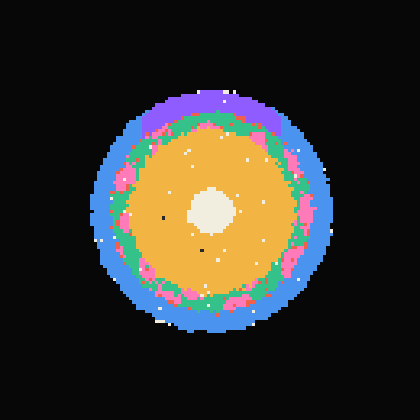
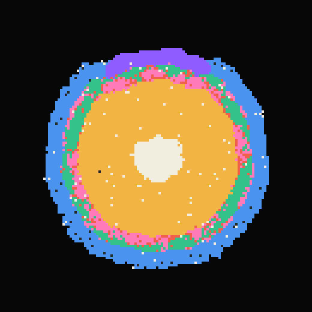

# Embryo Engine v1.0: the simulation core

`src/engine.js` grows an embryo from 37 identical cells on a 200 × 200 torus. One conservation law, three rules and four signal fields produce four concentric germ layers, an anterior neural plate, and a mesoderm ring that a Turing activator–inhibitor pattern breaks into blocks of muscle separated by vessel.

What is local and what is not: Rules 1 and 2 involve only a cell and its neighbours. Rule 3 reads a cell's depth below the outer surface against band edges scaled to the whole embryo's depth, and the muscle/vessel reference is the mean activator of every live cell at the same depth. The midline and A–P signals are positional information laid down around the embryo's centroid, with anterior fixed to the grid's −y side. So the order of the layers is what Rule 3 assigns, and the neural plate sits where the two imposed gradients overlap. What organises itself is the activator–inhibitor pattern and the muscle blocks it carves, the embryo's size, its turnover, and the self-renewing stem core. No cell ever moves, so this is layering by position, not gastrulation by cell migration.

v1.0 rebuilds the v0.9 engine after an audit that found 46 problems. The main ones: energy leaked, the inhibitor field was a numerical checkerboard, the "Turing" kinetics could not form patterns, and the layering came from transient death-holes, not from the body surface. Every number on this page was measured on the shipped engine, over 5 seeds and 20,000 ticks, unless it says otherwise.

| T1,000 | T5,000 | T20,000 | Activator, T5,000 |
|---|---|---|---|
|  |  |  |  |

*Seed 1, all at the same scale (4 px per cell, a 130-cell window centred on the embryo, anterior up). Colours are `TISSUE_HEX`: ectoderm blue, neural violet, mesoderm red, muscle pink, vessel green, endoderm amber, stem cream. Dark grey dots are interior gaps. The activator panel uses a magma ramp over the fixed domain [0, 3]. It shows a self-organised labyrinth with a wavelength of about 11–14 cells, plus the boundary stripe along the surface.*

---

## The law and the rules, in plain language

**Law: energy is conserved exactly.** The embryo starts with 250,000 units shared equally by 37 founder cells. Nothing creates energy and nothing destroys it. Cells pass it to their neighbours, split it when they divide, and give all of it away when they die.

**Rule 1: divide.** A cell divides when its energy exceeds a threshold: 30 for stem cells, 42 for differentiated cells. It must also be older than 14 ticks (age counts from its birth or its last division). It needs a free 4-neighbour to put the daughter in, chosen at random among the free ones. Parent and daughter each get half the energy. Every daughter is born a **stem** cell. The free 4-neighbour is either at the rim, or a hole left by a cell that died inside the tissue earlier in the same tick (or the tick before). Early growth is at the rim: 68–71% of births at T1,000. From about T3,000, 79–93% of births refill interior holes, and only the rim adds net cells (births minus deaths per 200 ticks falls from about 270 at T1,000 to 4–26 at T20,000; 5 seeds).

**Rule 2: die.** A cell dies:
- of old age, past its lifespan (500 × a type factor, ±75 ticks), or
- when it has no live neighbour (isolation), or
- with probability 0.08 per tick when it has exactly one live neighbour (a dangling tip).

All of its energy goes to its live 4-neighbours. If it has none, the energy goes to the live cells at distance 2. If there are none there either, it goes to a global pool that is spread evenly over every live cell at the end of the tick.

**Rule 3: depth decides fate, continuously.**
- **Depth** is how many steps a cell sits below the embryo's outer surface. The outside is the empty region connected to the rest of the grid. Holes inside the body are not surface.
- The embryo's thickness `dRef` is the maximum depth, passed through a deadband so it does not jitter.
- Four bands scale with that thickness:
  - outer 15%: **ectoderm**, or **neural** where the midline and anterior–posterior signals both exceed 0.18
  - next 15%: **mesoderm**
  - down to 85%: **endoderm**
  - the innermost core: **stem**
- Every germ-layer cell (stem, ecto, meso, endo) older than 12 ticks re-reads its band every tick and becomes what the band demands. As the embryo grows, yesterday's skin is buried and becomes mesoderm, and yesterday's mesoderm becomes gut. Mesoderm mostly reaches the gut by the terminal route (it specialises to muscle or vessel after 40 ticks, then reverts to endoderm after 150 ticks buried). Once growth slows, band crossings fall to a few per 200 ticks and the layers are kept mainly by newborn stem cells taking their band's fate.
- The founders all take a fate at T14, before the embryo is thick enough to have a core band, so for a while there are no stem cells at all. The core first forms (from about T100–400) from buried endoderm, and early muscle, turning back into stem; after that it renews itself by stem cells dividing into holes left by deaths. At any moment only about two thirds of the stem cells are in the core band: the rest are newborns elsewhere.
- Neural, muscle and vessel are **terminal**. They keep their fate while they sit in their own band. Buried (or exposed) for 150 consecutive ticks, they revert to their band's fate.

**Signals.** Four fields diffuse and decay on the grid:
- **Activator and inhibitor** follow Gierer–Meinhardt kinetics on live cells. The slowly diffusing activator enhances itself, and the fast inhibitor suppresses it. This forms spots and stripes about 11–14 cells apart (activator autocorrelation peak at T5,000: r = 11 for seed 1, 13–14 for seed 2).
- **Muscle and vessel.** A mesoderm cell that has stayed mesoderm for 40 ticks compares its activator with the mean activator of the cells at its own depth. It becomes **muscle** above 1.2× that mean and **vessel** below 0.8×.
- **Midline and anterior–posterior (A–P).** These fields are deposited around the embryo's centroid and gate the neural plate at the anterior surface.

### One tick, in order

1. Diffuse the four fields. The inhibitor uses two stable sub-steps.
2. Gierer–Meinhardt reaction on live cells, in raster order. Measure the tissue-mean and per-depth-mean activator.
3. Share energy: every live cell exchanges 5% of the difference with its live right and lower neighbours, in an in-place raster sweep.
4. Shuffle the live cells (Fisher–Yates).
5. For each cell in that random order:
   - age +1, then die (Rule 2)
   - divide (Rule 1)
   - deposit midline, A–P and type-specific signals
   - Rule 3 with hysteresis, or terminal reversion
   - mesoderm specialisation
6. Spread the orphan pool, if any.
7. Swap buffers. One end-of-tick pass over the embryo's bounding box recomputes counts, the compensated energy sum, the living list, the centroid, the exterior flood fill, depth, `dmax`, `dRef`, the band edges and the band of every cell.

Depth and bands are therefore always those of the current state. Nothing is recomputed twice, and the Depth view reads `sim.depth` directly.

### Rule 3 in detail

- `depth`: live cells 1…254 (1 = touches the exterior through a 4-neighbour). Empty cells: 0 = exterior, 255 = interior gap. The exterior is found by flood-filling the empty cells connected to the frame of the embryo's bounding box. When the embryo nears the torus seam, it falls back to the largest empty component. Depth then spreads inward from the live cells that touch the exterior, through tissue and interior gaps alike.
- **Metric (`depthMetric: 'octagonal'`)**: odd BFS rings may also step diagonally. With 4-neighbour steps only (Manhattan), layers are diamonds and the stem core is an axis-aligned square. The octagonal metric keeps them round (it stays within about 11% of Euclidean distance, where Manhattan is up to 41% off along diagonals). `'manhattan'` remains available as a parameter. Both are covered by the depth test.
- **Bands**: `e1 = max(1, round(0.15·dRef))`, `e2 = max(2, round(0.30·dRef))`, `e3 = max(6, ceil(0.85·dRef))`. Band 1 if d ≤ e1, 2 if d ≤ e2, 3 if d < e3, else 4. At small sizes these reduce to v0.9's 1 / 2 / 3–5 / 6+.
- **Hysteresis** (three layers, from coarse to fine):
  1. `dRef` moves only when `dmax` leaves [dRef − 1, dRef + 1], so the band edges do not jitter when the deepest cell dies or is born.
  2. A cell keeps its current band while its depth is within ±1 of that band.
  3. It changes fate only after 6 consecutive ticks of disagreement, on top of the 12-tick `diffAge`.
- **Clocks**: a STEM → X change resets age and draws the new type's lifespan. Re-specification between germ layers (ecto → meso → endo → stem) keeps the cell's clock. Terminal commitment (MESO → MUSCLE / VESSEL) resets the clock, as in the audit's `allfix_rel` base, so the longer terminal lifespans (muscle 800, vessel 900) are real.

---

## Measured behaviour (5 seeds × 20,000 ticks)

### Composition (% of live cells, mean ± sd over seeds 1–5)

| Tick | Cells | Stem | Ecto | Meso | Endo | Neural | Muscle | Vessel |
|---|---|---|---|---|---|---|---|---|
| T1,000 | 1694 ± 3 | 5.4 ± 0.2 | 25.5 ± 0.2 | 2.9 ± 0.3 | 33.1 ± 0.4 | 10.8 ± 0.1 | 9.8 ± 0.3 | 12.6 ± 0.2 |
| T2,500 | 3086 ± 4 | 5.9 ± 0.1 | 23.0 ± 0.1 | 2.9 ± 0.2 | 41.9 ± 0.3 | 8.4 ± 0.1 | 9.9 ± 0.4 | 8.0 ± 0.4 |
| T5,000 | 4347 ± 5 | 4.9 ± 0.2 | 23.5 ± 0.1 | 2.1 ± 0.1 | 42.9 ± 0.3 | 6.9 ± 0.1 | 7.0 ± 0.4 | 12.8 ± 0.5 |
| T20,000 | 6895 ± 9 | 5.8 ± 0.4 | 22.4 ± 0.1 | 2.8 ± 0.3 | 45.3 ± 0.3 | 4.3 ± 0.1 | 8.0 ± 0.3 | 11.3 ± 0.6 |

For comparison, v0.9 (audit, 10 seeds):
- T5,000: Stem 5.7, Ecto 16.2, Meso 0.4, Endo 62.8, Neural 1.2, Muscle **0**, Vessel 13.6.
- T20,000: 5.7 / 9.9 / 0.5 / 63.9 / 1.6 / **0** / 18.5.

Every v0.9 vessel was a checkerboard artifact, and muscle never formed.

Cumulative totals at T20,000: 104,631 ± 154 births, 97,774 ± 155 deaths, 112,354 ± 320 fate changes. Growth slows as energy per cell approaches the division thresholds: 250,000 / 6,895 ≈ 36.3, between the stem (30) and differentiated (42) thresholds.

### Layering (mean depth per family) and pattern quality

| Tick | dmax | e1 / e2 / e3 (seed 1) | Ecto | Meso family | Endo | Stem | Neural | Muscle clustering | Vessel clustering | Neural Δy | Interior gaps |
|---|---|---|---|---|---|---|---|---|---|---|---|
| T1,000 | 21.0 ± 0.0 | 3 / 6 / 17 | 2.8 | 6.7 | 12.2 | 15.4 ± 0.6 | 3.2 | 0.76 ± 0.01 | 0.76 ± 0.00 | −18.3 | 0.2 |
| T2,500 | 28.0 ± 0.0 | 4 / 8 / 23 | 3.0 | 7.5 | 15.0 | 21.4 ± 0.6 | 3.4 | 0.67 ± 0.02 | 0.63 ± 0.03 | −25.5 | 0.6 |
| T5,000 | 33.8 ± 0.4 | 5 / 10 / 29 | 3.3 | 8.6 | 17.9 | 24.6 ± 0.3 | 3.6 | 0.62 ± 0.02 | 0.72 ± 0.01 | −31.3 | 0.8 |
| T20,000 | 41.8 ± 0.4 | 6 / 12 / 35 | 3.6 | 9.7 | 21.4 | 32.0 ± 0.9 | 3.8 | 0.61 ± 0.02 | 0.72 ± 0.01 | −40.2 | 36.8 ± 7.4 |

- **Concentric order** ecto < meso family < endo < stem holds at every checkpoint in every seed.
- **Clustering** is the mean fraction of a cell's live 4-neighbours that share its type. 1 means solid blocks and about 0.07 means salt-and-pepper at muscle's abundance. The acceptance bar is 0.4.
- **Neural Δy** is the mean y-offset of neural cells from the body centroid. Negative means anterior (−z in the 3D scene).
- In the v1.0 T20,000 state, 96.2 ± 0.3% of live cells carry the fate their band assigns (families counted together).
- **Interior gaps** grow after about T15,000, as the rim becomes porous under the tip and isolation deaths. The audit saw the same trend in v0.9.

### First appearance (tick; min / median / max over 5 seeds)

| Type | Stem | Ecto | Meso | Endo | Neural | Muscle | Vessel |
|---|---|---|---|---|---|---|---|
| First seen | 0 | 14 / 14 / 14 | 14 / 14 / 14 | 14 / 14 / 14 | 615 / 629 / 637 | 55 / 55 / 55 | 323 / 337 / 338 |

At T14 the 37-cell founder ball reads its depth for the first time. Its mesoderm specialises 41 ticks later, which gives the first few muscle cells at T55. The "Muscle" milestone (≥ 10 muscle cells, T335–364) marks isolated cells: their clustering is 0.00–0.07 (largest clump 1–2 cells), all just past the mesoderm band's inner edge. Blocks come later: clustering reaches 0.4 at T384–542 across seeds 1–5 and 0.6 by about T565–600 (0.73–0.77 at T700–1,000). The 3D callout says "Muscle" until the clustering passes 0.4, then "Muscle blocks".

### Milestones (conditions from `shared.js` `MILESTONES[].when`)

| Milestone | Condition | Tick (min / median / max) |
|---|---|---|
| Seed | T0 | 0 |
| First fates | any non-stem cell | 14 / 14 / 14 |
| Four layers | cells ≥ 200, ecto ≥ 5%, meso-family ≥ 5%, endo ≥ 5%, stem ≥ 1% | 282 / 311 / 311 |
| Muscle | muscle ≥ 10 (scattered cells, not yet blocks) | 335 / 356 / 364 |
| Gut core | cells ≥ 500 and endo > ecto | 363 / 363 / 398 |
| Neural plate | neural ≥ 10 | 648 / 656 / 663 |
| Turnover | tick > 1000 and \|births − deaths\| < 0.15·births over the last 500 ticks | 3,558 / 3,585 / 3,633 |
| Founders gone | `foundersAlive === 0` | 6,516 / 8,837 / 15,125 |

By median tick the order is first fates, four layers, muscle, gut core, neural plate, turnover, founders gone. Muscle and gut core fire within about 35 ticks of each other and can swap: seeds 1 and 3 reach gut core at T363, one tick before muscle. That differs from the array order in `shared.js`, so timeline code sorts reached milestones by tick. The last founders survive in the stem core by self-renewal: they divide into a dead neighbour's space, and division resets age.

### Conservation, stability, hysteresis, speed

- **Energy**:
  - The worst relative |total − 250,000| over every tick of all five 20K runs is 2.3 × 10⁻¹⁶, one or two ulps of the compensated sum.
  - `energyLost` stays 0 and empty cells hold exactly 0.
  - v0.9 lost about 40–170 units per orphan event, and 0.44–0.62% of the total by T100K.
- **Inhibitor**: the parity (checkerboard) index is ≤ 1.1 × 10⁻⁴ at every 500-tick checkpoint (v0.9: 1.0), and the largest per-cell change in one tick after T200 is ≤ 0.05 (v0.9: about 7.8 every tick).
- **Flip-flops**: a fate change undone within 50 ticks. Measured 0 per 100 ticks in all 5 × 200 windows. During tuning (Manhattan metric), persistence 20 alone without the ±1 depth margin gave 0.38% on average with spikes to 3.8%, and persistence 6 alone spiked to 50% around T300.
- **Speed** (Apple M2 Pro):
  - node, single thread, about 7,000 cells: **0.55–0.62 ms/tick** (the test's best of 3 × 1,000 ticks).
  - Chrome module worker, seed 1 for T0–5,000: 0.27 ms/tick.
  - After warm-up, `step()` allocates nothing that the sampling heap profiler can attribute to `engine.js` (< 0.1 B/tick over 3,000 ticks), and the heap is flat over 5K ticks.
  - A second live instance (for example a snapshot being viewed) costs nothing extra. See "Implementation notes".
- **Determinism**: seeded sfc32 and no transcendental `Math` calls in the dynamics. Golden hash `hashState` = **`472c912f`** for seed 1 at T5,000, identical in node 26 and in a Chrome module worker. A snapshot taken in the worker, transferred, restored on the main thread and stepped 500 ticks matches the uninterrupted run.

---

## Changelog vs v0.9 (audit findings)

| Audit finding | v1.0 fix | Why it mattered |
|---|---|---|
| **orphan-death-energy-sink**, **energy-leak-isolated-death** | A dying cell with no live 4-neighbour gives its energy to the live cells at Manhattan distance 2. If there are none, the energy goes to a global pool spread over all live cells at the end of the tick. Energy is stored in Float64. | "Zero sinks" was false: each orphan death destroyed about 40–170 units, and 0.44–0.62% was lost by T100K. Now conservation is exact by construction. |
| **float32-drift-negligible** | Float64 energy with a Neumaier compensated sum. The initial split is exact to 1 ulp. | Drift was already negligible (1.7 × 10⁻⁷). The ledger is now exact enough that any real leak would stand out. |
| **conserved-meter-blind**, **readme-conservation-claims** | `stats().totalEnergy` (compensated) and `energyLost` (cumulative, 0) are exposed for an absolute Σ readout. This page states the measured drift. | The UI's "100.0%" hid real losses. |
| **inhibitor-diffusion-unstable** (dynamics, performance, UI strobe) | Any channel with r > 0.24 is sub-stepped: the inhibitor's r = 0.325 runs as 2 × 0.1625 with decay 0.96^½ per sub-step (same total D and decay). | Explicit Euler is unstable above r = 0.25. The inhibitor was a torus-wide 0/8 checkerboard flipping every tick. It made every v0.9 vessel, about 26% of deaths (through the stem rule), and a strobing Inhibitor view. |
| **turing-kinetics-dead** | Real Gierer–Meinhardt kinetics: activator D = 0.03, `a += 0.01·a²/((b+0.001)(1+0.02a²)) + 0.0005 + noise`, `b += 0.01·a² − 0.02·b`, both clamped to [0, 8]. Muscle/vessel thresholds are relative (1.2× / 0.8× the mean activator at the cell's depth). | The old activator had a single stable fixed point (a ≈ 0.014), so no pattern and no muscle could ever form. The fields now self-organise into spots and stripes, and muscle exists (7–10%). |
| **depth-seeded-by-interior-holes** | Depth is measured from the **exterior**: a flood fill of the empty region outside the embryo. Interior gaps are not surfaces. Bands scale with thickness (15% / 30% / 85%). | 72% of v0.9 fates were decided by the nearest recent death-hole, which gave a salt-and-pepper interior. Exterior depth with fixed bands would turn 68% of the embryo into stem. Relative bands give clean concentric layers. |
| **fate-never-reevaluated** | Rule 3 is applied continuously to stem, ecto, meso and endo, with hysteresis. Re-specification keeps the cell's clock. Terminal types revert after 150 ticks out of their band. | v0.9 fixed fate once at age 13, so the embryo was about 96% ectoderm until the first generation died of old age. "Gastrulation" was really senescence. Now the layers exist from the start and thicken as the embryo grows. |
| **stage-labels-wrong** | Stages come from state: the `shared.js` milestones, with the measured ticks listed above. | v0.9 labelled stages by tick count, and the labels described events that never happened. |
| **readme-composition-mismatch** | Composition is regenerated from 5 seeds at 4 checkpoints (above). | v0.9's table did not match any measured state. |
| **anterior-division-bias-inert** | Removed. | It changed the direction of about 0.25% of divisions and had no measurable effect on shape or composition. It also consumed random numbers. |
| **toroidal-centroid** | The centroid is the plain mean while the embryo is away from the seam. Near the seam it switches to minimum-image offsets from the previous centroid. Both are exact integer sums plus one division, so they are deterministic across JS engines. Midline and A–P use minimum-image offsets. | Latent bug: a seam crossing would have moved the centroid about 100 cells and flipped the A–P signal. The ADDENDUM asked for a circular mean; the unwrap mean is equally toroidal-safe and needs no `atan2`/`sin`/`cos`, which differ across engines. |
| **ui-seedcount-mismatch** | `sim.seedCount` (37) comes from the founder disk itself. | The v0.9 UI showed 29. |
| **energy-brightness-saturated** | The engine exposes exact Float64 energy, and `shared.js` packs it log-encoded into the texture. | Linear clamps at 25/30 saturated 99% of cells. |
| **checked-no-action** | The Gauss–Seidel sharing sweep is kept (no measurable bias). The duplicate `maxAge` copy is gone. | Confirms the sweep is not a hidden source of anisotropy. |
| **simstep-alloc-wrap-redundant** | All buffers are allocated once. Types and fields ping-pong; energy, age and maxAge update in place. A precomputed neighbour table replaces modulo, and the queues are typed arrays. | v0.9 allocated about 1 MB per tick and spent most of its time in modulo arithmetic. |
| **diffusion-full-grid** | Diffusion runs only over the bounding box of non-zero values + 1. This is exact, because everything outside stays +0. It falls back to the full axis at the seam. | This is now possible for all four fields, because the inhibitor is stable and therefore sparse. |
| **export-const-pitfall** | Hot constants are file-local literals, and loops use neighbour tables, never an imported binding. | Exporting `GS` made v0.9's modulo stencil 1.8–2.9× slower in module builds. |
| **depth-view-double-bfs** | Depth is computed once, at the end of each step, for the new state, and is exposed as `sim.depth`. | v0.9 ran the BFS twice while the Depth view was on. |
| **worker-design-cost** | Pure module with no DOM, running in node and in module workers. Snapshots are transferable. The event ring lets the worker animate births, deaths and fates. | Enables the worker architecture of the 3D build. |
| Stem death at `inhibitor > 1.8` (from the inhibitor audit) | Removed. Death cause index 3 (`crowded`) is unused. | It fired only because of the checkerboard, and never under the fixed kinetics. |
| `Math.random`, `Math.exp` | Seeded sfc32 (splitmix32 seeding) and a deterministic e^(−u) polynomial. | Replays, share links and snapshots are exact, in node and in browsers. |

### Decisions beyond the audit's `allfix_rel` variant (measured)

1. **v0.9's activator and inhibitor deposits are off** (`sources.birthAct = endoAct = deathInh = 0`).
   - What they were: rim births added +0.1 activator, endoderm added +0.006 per tick, and deaths added +0.06 inhibitor. They were patches for v0.9's dead activator.
   - Why remove them: under real Gierer–Meinhardt kinetics they entrain the pattern into concentric rings that follow the growing surface. The mesoderm ring then sits in a trough and becomes almost all vessel.
   - Muscle clustering at T5,000 (5 seeds, Manhattan metric): deposits on 0.38 ± 0.02; birth deposit off 0.36; endo deposit off 0.49; all off 0.57 ± 0.05.
   - Without them the activator is a purely self-organised labyrinth. They remain parameters.
2. **The muscle/vessel reference is the mean activator at the cell's own depth** (`gates.mesoReference = 'depth'`), not the whole-tissue mean.
   - The boundary stripe makes the activator vary strongly with depth. Against the tissue mean, the ring splits radially (muscle outside, vessel inside).
   - Against the depth-shell mean, what remains is the variation *along* the ring. It breaks into alternating blocks: clustering 0.68 ± 0.03 vs 0.57 at T5,000.
   - The thresholds 1.2× and 0.8× and the 40-tick age are the ADDENDUM's values. Alternatives (1.1/0.9, 1.3/0.7, 20 or 80 ticks; 3 seeds) gave clustering 0.51–0.65 at T5,000, against 0.62 for the defaults, so the defaults were kept.
3. **Hysteresis** as described above.
   - Deadband 1 on `dmax`, depth margin ±1, persistence 6.
   - Band-edge changes are rare (27 in 5,000 ticks). Flips came from per-cell depth jitter as rim cells are born and die, which the margin absorbs (see "Flip-flops" above).
4. **Terminal reversion after 150 ticks.**
   - Manhattan-metric runs, 5 seeds, at T1,000: without reversion 74% of terminal cells sit outside their band and only 44% of live cells match their band's family (vessel 36% floods the interior); with it, 49% and 76%.
   - Final engine: 55% and 72% at T1,000, and 4.7% and 96.2% at T20,000.
   - 60 or 300 ticks (3 seeds) shift the T1,000 composition by up to 5 points (faster reversion means more endoderm early). They are indistinguishable from T5,000 on.
5. **Octagonal depth metric** (see Rule 3). It keeps layers, the stem core and the 3D dome round. Against Manhattan, composition changes by at most 3.4 points at T1,000 and 1.2 points at T20,000.
6. **A second instance must stay fast.** See "Implementation notes".

---

## API (as in ADDENDUM §A.2; extras marked +)

```js
import { ENGINE_VERSION, PARAMS, FIELD_INFO, createSim, hashState } from './src/engine.js';
const sim = createSim({ seed: 1, params: {} });  // params deep-merge over PARAMS
sim.step(n);                  // ping-pong: re-read sim.type / sim.morph after every step
sim.drainEvents(int32Array);  // → count; events that do not fit stay queued; then sim.eventsDropped = ring overflow since the previous drain
sim.stats();                  // fresh EngineStats object (+ dRef, recycledThisTick, totalRecycled, flipFlopsThisTick, totalFlipFlops)
sim.readCell(idx);            // CellDetail or null (+ ruleBand: the band Rule 3 applies after hysteresis, pending: ticks of disagreement)
sim.snapshot();               // { kind, version, seed, tick, rng: Uint32Array(4), meta, buffers: {14 ArrayBuffers} }, 1.8 MB, transferable
sim.restore(snapshot);        // exact; also restores sim.seed
hashState(sim);               // FNV-1a over type, energy bits, age and the PRNG state → 8 hex chars
```

- **Fields**:
  - `tick`, `seed`, `seedCount`
  - `type` (Uint8), `energy` (Float64), `age`, `maxAge` (Uint16)
  - `morph` (4 × Float32: activator, inhibitor, midline, A–P)
  - `depth` (Uint8; live 1..254, empty 0 exterior / 255 gap), `band` (Uint8; 0 empty, 1..4)
  - `dmax`, `bands {e1, e2, e3}` (updated in place)
  - `prov {bornTick, founder, fateTick, fateFrom, typeSince}`
  - `eventsDropped`, `params`
- **Provenance**:
  - Daughters inherit `founder` (lineage 0..36).
  - `fateTick` is `0xFFFFFFFF` and `fateFrom` is 0 until the cell's first type change; `readCell` returns `null` for both then.
  - `typeSince` is the tick the current type began.
- **Methods** are bound, so `const { step } = sim` works.
- **`stats().bands`** are computed from `dRef`, the deadband-filtered `dmax`, which is what the rule uses. `stats().dmax` is the raw value.
- **Events** follow `shared.js`:
  - A DEATH `recipientMask` of 0 means the energy went to distance-2 cells or to the pool.
  - A FATE `b` is the band the rule applied (after hysteresis).
  - FATE events are emitted for every type change: first fates, re-specification, specialisation and reversion.
- **Snapshot compatibility**: snapshots store the state, not the parameters. Restore them into a sim created with the same `params`.

### Implementation notes

- **Class plus module-level helpers, not closures.** With closures, a second live instance (the worker keeps the live sim and a snapshot-view sim) stops V8 from treating closure variables as constants. Helpers then stop inlining and returned doubles get boxed: 0.57 MB/tick of garbage and +60% time. The class version runs the same with one or two instances.
- **Doubles that change every tick** live in typed arrays (`F`, `dcoef`). The PRNG returns a 30-bit Smi that call sites scale, so no call boundary carries a boxed double.
- **The PRNG state is an `Int32Array`**, because int32 values outside the Smi range would be boxed on every write.

---

## PARAMS

```json
{"totalEnergy":250000,"seedRadius2":10,"depthMetric":"octagonal","divThreshStem":30,"divThreshDiff":42,"divCooldown":14,"diffAge":12,"shareRate":0.05,
 "senescence":{"base":500,"spread":150,"factor":[0,0.6,1.3,0.9,1.4,2.5,1.6,1.8]},
 "death":{"tipP":0.08,"orphanRadius":2},
 "bandFrac":{"ecto":0.15,"meso":0.3,"endo":0.85},"bandMin":{"ecto":1,"meso":2,"endo":6},
 "hysteresis":{"dmaxDeadband":1,"depthMargin":1,"persist":6,"terminalRevert":150,"flipWindow":50},
 "gates":{"neuralMid":0.18,"neuralAP":0.18,"muscleRel":1.2,"vesselRel":0.8,"mesoSpecializeAge":40,"mesoReference":"depth"},
 "diffusion":{"rates":[0.03,0.325,0.234,0.208],"decay":0.96,"maxRate":0.24,"substeps":[1,2,1,1],"floor":0.0003,"cap":8},
 "kinetics":{"rho":0.01,"sat":0.02,"epsB":0.001,"basal":0.0005,"noise":0.02,"inhProd":0.01,"inhDecay":0.02,"cap":8},
 "sources":{"birthAct":0,"deathInh":0,"midline":0.01,"midlineSigma":14,"ap":0.01,"apScale":20,"ectoMid":0.002,"neuralMid":0.012,"neuralAP":0.008,"mesoAP":0.004,"endoAct":0,"founderAct":[0.3,0.3],"founderAPStep":0.08,"founderAPLen":6}}
```

- **Lifespans** (`senescence.factor` by type; stem, ecto, meso, endo, neural, muscle, vessel): stem 300, ecto 650, meso 450, endo 700, neural 1250, muscle 800, vessel 900, each ±75. Founders use 500 ± 75.
- **Midline and A–P deposits** per tick:
  - midline: `0.01·e^(−dx²/392)`, with dx the minimum-image offset from the centroid;
  - A–P: `0.01·max(0, (cy − y)/20)`;
  - plus by type: ecto +0.002 midline; neural +0.012 midline and +0.008 A–P; meso and muscle +0.004 A–P.

## FIELD_INFO

Domains are fixed from the p99 of live cells over 5 seeds × 20K ticks, sampled every 250 ticks from T1,000 (one script, seeds 1–5; `src/engine.js` points here rather than repeating the numbers):

| Field | p99 (max over samples) | Max | Median |
|---|---|---|---|
| Activator | 3.03 (2.76 without the T1,000 sample) | 5.33 (3.26 without T1,000) | 1.16 |
| Inhibitor | 0.55 | 0.63 | 0.29 |
| Midline | 0.42 | 0.46 | 0.14 |
| A–P | 0.60 | 0.63 | 0.04 (hence `sqrt`) |

The activator's highest values are a single transient (seed 4 at T1,000); the domain [0, 3] covers the p99 of every later sample.

```json
[{"key":"activator","label":"Activator","channel":0,"domain":[0,3],"scale":"linear","gates":[{"v":1.49,"rel":1.2,"label":"Muscle: > 1.2× mean at that depth"},{"v":0.99,"rel":0.8,"label":"Vessel: < 0.8× mean at that depth"}]},
 {"key":"inhibitor","label":"Inhibitor","channel":1,"domain":[0,0.6],"scale":"linear","gates":[]},
 {"key":"midline","label":"Midline","channel":2,"domain":[0,0.45],"scale":"linear","gates":[{"v":0.18,"label":"Neural gate (with A–P)"}]},
 {"key":"ap","label":"A–P","channel":3,"domain":[0,0.65],"scale":"sqrt","gates":[{"v":0.18,"label":"Neural gate (with midline)"}]}]
```

The activator gates are relative. `rel` is the factor applied to the mean activator of cells at the same depth; `v` is its value at the typical tissue mean (1.24), for placing a legend mark. `stats().meanAct` is the tissue-wide mean for the current tick.

## Tests

`node --test test/` runs in about 17 s on the M2 Pro and covers ADDENDUM §A.3 items 1–8 plus flip-flops, orphan-energy routing and `readCell`:
- The five 20K-tick runs execute in parallel worker threads: conservation, events vs stats, inhibitor stability, flip-flops, and biology at T5,000 on all 5 seeds.
- Depth is checked against a naive BFS on 110 states. These cover both metrics, random holes, sealed pockets, an island inside a gap, a diagonal-only pocket, an open channel, and states rolled across the torus seam.
- DEATH energies are verified exactly by replaying the sharing sweep and every recycle in event order.

## Known limitations

- After about T15,000 the rim becomes porous: 37 interior gaps at T20,000. The tip and isolation death rules act on a turning-over surface, as the audit found for v0.9.
- Muscle blocks are crispest from T1,000 to T5,000 (clustering 0.76 to 0.62). Later the ring is still block-structured but mixed (0.61).
- "Gut core" (endo > ecto) fires at about T363, before the neural plate. With continuous Rule 3 the endoderm forms as soon as the embryo is thick enough.
